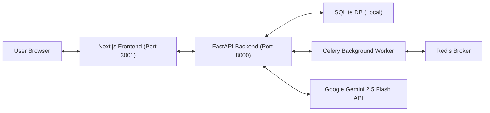
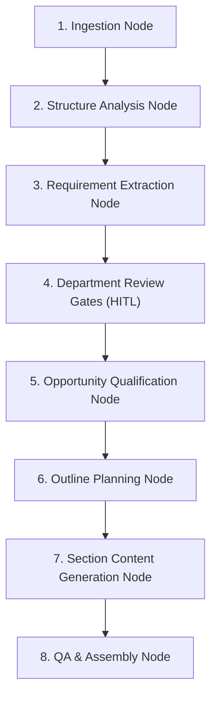

# Master System Architecture (`architecture.md`)

This document provides a high-level overview of the SPS Enterprise AI Proposal Capture Manager system architecture, data ingestion flows, and agent orchestration.

---

## 1. Architectural Overview

The platform uses a decoupled client-server architecture:

### 1.1 Ingestion & Parsing Flow
1. **Intake**: A document (PDF/Word) is uploaded via the **UploadCenter** component to `/api/v1/documents/upload`.
2. **Persistence**: The document metadata is saved to SQLite, and the file binary is stored in `/storage/`.
3. **Parsing**: The backend `PDFProcessor` (via PyMuPDF) or `DOCXProcessor` extracts raw text segments and passes them to the AI Engine.

---

## 2. Multi-Agent Coordination & LangGraph

The system lifecycle is managed as a stateful graph via LangGraph:

### 2.1 Department Review Gates (Human-In-The-Loop)
Each department review node evaluates captured requirements against business rules:
* **Financial Review**: Triggers GO / NO_GO decision based on payment terms (NET30).
* **Legal Review**: Checks liability limits ($5M cap).
* **Operations & Technical Reviews**: Flag delivery and deployment feasibility risks.
* **Human Override**: Allows project coordinators to override AI recommendations with clear auditing logs.

---

## 3. Data Schema & Models

Data structures are relationally organized inside `/backend/app/models/`:
* **Core Entities**: `Opportunity`, `RFPDocument`, `Requirement`, `Deliverable`.
* **Planning Entities**: `ProposalPlan`, `ProposalSection`, `ComplianceItem`, `ProposalTask`, `ProposalMilestone`.
* **Audit & AI**: `AgentExecution`, `ExplainabilityRecord`, `SearchLog`, `GovernancePolicy`.
* **Review States**: `FinancialReview`, `LegalReview`, `OperationsReview`, `TechnicalReview`, `ReviewOverrideHistory`.
