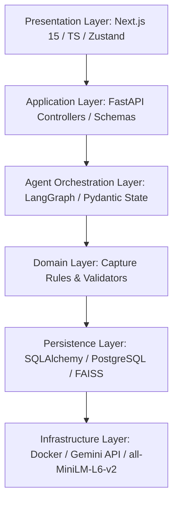

# Phase 0: Design & Architectural Foundation Report

This document establishes the architectural foundation, repository standards, and governance framework for the SPS Enterprise AI Proposal Capture Manager.

---

## 1. Architecture Review Report

### Proposed Layered Architecture


### Critical Architectural Review
- **Modular Boundaries**: Strict layer separation prevents domain leak. The Agent Orchestration layer depends on Domain rules, and uses Persistence services. No bypassing is permitted.
- **Pydantic State Flow**: LangGraph states will store structured Pydantic models. This avoids untyped dictionaries and guarantees contract consistency.
- **Human-in-the-Loop (HITL)**: Implement four transaction gates:
  1. *Requirement Validation* (Gate 1)
  2. *Qualification Validation* (Gate 2)
  3. *Planning Validation* (Gate 3)
  4. *Final Proposal Validation* (Gate 4)
- **Search Relevancy**: Hybrid search merges BM25 and dense embeddings (`all-MiniLM-L6-v2`) via FAISS, then ranks them before passing to the Writer Agent.

---

## 2. Repository Structure

The enterprise codebase will be laid out as follows:
```
sps-proposal-capture-manager/
├── docs/                      # Specification & design logs
├── memory/                    # Project implementation & lessons state
├── frontend/                  # Next.js 15 Client
│   ├── public/
│   ├── src/
│   │   ├── app/               # App Router pages & layouts
│   │   ├── components/        # UI components (threejs, command center)
│   │   ├── hooks/             # Custom React Hooks
│   │   ├── services/          # API services
│   │   └── store/             # Zustand state
│   ├── package.json
│   └── tsconfig.json
├── backend/                   # FastAPI Server
│   ├── app/
│   │   ├── api/               # Router endpoints (v1)
│   │   ├── core/              # Config, security, logging
│   │   ├── agents/            # LangGraph workflows & states
│   │   ├── domain/            # Entities, domain models, validations
│   │   ├── models/            # SQLAlchemy models
│   │   ├── schemas/           # Pydantic schemas
│   │   └── services/          # RAG, Vector Search, file processing
│   ├── tests/                 # Pytest suite
│   ├── alembic/               # Database migrations
│   ├── requirements.txt
│   └── Dockerfile
├── docker-compose.yml         # Container configuration
└── README.md
```

---

## 3. Documentation Structure

All documents will reside under `docs/` and be sequentially ordered for accessibility and trace:
- `01_PROJECT_VISION.md`
- `02_BUSINESS_REQUIREMENTS.md`
- `03_SRS.md`
- `04_SYSTEM_ARCHITECTURE.md`
- `05_DATABASE_DESIGN.md`
- `06_UI_UX_SPEC.md`
- `07_AGENT_SPECIFICATIONS.md`
- `08_WORKFLOW_SPEC.md`
- `09_API_SPEC.md`
- `10_TESTING_STRATEGY.md`
- `11_SECURITY_AND_GOVERNANCE.md`
- `12_DECISION_LOG.md`
- `13_CHANGELOG.md`
- `14_PROGRESS_TRACKER.md`
- `15_KNOWN_LIMITATIONS.md`
- `16_FUTURE_ROADMAP.md`
- `17_FRONTEND_ARCHITECTURE.md`
- `18_UI_COMPONENT_LIBRARY.md`
- `19_AGENT_MEMORY_STRATEGY.md`
- `20_PROMPT_ENGINEERING_GUIDE.md`
- `21_RAG_ARCHITECTURE.md`
- `22_DEPLOYMENT_ARCHITECTURE.md`
- `23_TESTING_STRATEGY.md`
- `24_OBSERVABILITY_AND_AUDIT.md`
- `25_DECISION_ENGINE_SPEC.md`
- `26_PROJECT_RULEBOOK.md`

---

## 4. Memory Structure

Memory tracking is used to preserve contextual consistency over phases:
- `memory/project_memory.md`: System objectives, baseline concepts, domains.
- `memory/architecture_memory.md`: Tech-stack, trade-offs, configuration.
- `memory/implementation_state.md`: Component status, phase completion maps.
- `memory/completed_features.md`: Chronological log of approved features.
- `memory/pending_features.md`: Future queue of feature integrations.
- `memory/known_issues.md`: High-priority technical debt or bugs.
- `memory/lessons_learned.md`: Code refactoring and agent flow optimizations.

---

## 5. Governance Framework

- **Approval Gates (Strict Enforcement)**:
  - Workflows halt at Gates 1-4. Continuation requires a signed transaction or status update via the human-in-the-loop dashboard.
- **Agent Validation**:
  - Guardrail checks verify agent outputs against schemas. Outputs failing compliance metrics are auto-rejected and sent to corrective agent nodes.
- **Access Control**:
  - Relational mapping of user roles (Admin, Writer, Reviewer) defines who can sign off on approval gates.

---

## 6. Coding Standards

- **TypeScript**: Strict mode enabled. No `any` type allowed. All UI components typed explicitly.
- **Python**: PEP 8 compliance. Strict static typing (`mypy`). Use standard type hinting for functions, parameters, and models.
- **Agent Inputs/Outputs**:
  - No dictionaries. Every agent receives a class derived from `pydantic.BaseModel` and returns one.
  - The return model must implement the **Structured Agent Output Standard**:
    ```python
    class AgentOutput(BaseModel):
        decision: str
        confidence: float  # Range: 0.0 to 1.0
        reasoning: str
        evidence: List[str]
        risks: List[str]
        recommendations: List[str]
    ```

---

## 7. Testing Standards

- **Test-First Thinking**: Write tests alongside endpoints and agents.
- **Coverage**: Maintain a minimum of 80% test coverage across backend (`pytest`) and frontend (`vitest`).
- **Integration Tests**: Verify LangGraph execution paths, mocking API calls to Gemini 2.5 Flash.
- **End-to-End Tests**: `playwright` tests validating the four Human Approval Gates.

---

## 8. Risk Register

| Risk ID | Description | Severity | Mitigation Strategy |
|---------|-------------|----------|---------------------|
| R-001   | Incomplete parsing of complex nested tables in PDF RFPs | High | Utilize document parser fallback engines with human layout review in Gate 1. |
| R-002   | Vector retrieval fetching irrelevant historic context | Medium | Implement BM25 + Vector hybrid search with a Cross-Encoder reranker. |
| R-003   | LLM hallucination in generated proposal answers | High | Compliance & Review agent validates generated responses against compliance matrix rules. |
| R-004   | API Rate limits or service downtime on Gemini | Medium | Establish retries with exponential backoff and localized error handling in Orchestrator. |

---

## 9. Assumption Register

- **A-001**: All RFP documents are uploaded as readable text PDFs or DOCX files (scanned images will require OCR processing).
- **A-002**: Local FAISS vector index is sufficient for the initial MVP; migration to a distributed vector search DB (e.g., Qdrant) is planned for scale.
- **A-003**: The user workspace has local access to PostgreSQL database setups (via Docker Compose).

---

## 10. Traceability Strategy

- Each extracted RFP requirement is assigned a unique `RequirementID`.
- Every generated proposal section is linked to the `RequirementID` and the source text chunk in the vector base.
- Visual mapping in the frontend display will allow users to hover over proposal lines and view direct citations and raw context sources.

---

## 11. Audit Strategy

- All events, agent invocations, and user actions are written to database audit logs.
- Modifications made by human reviewers in approval gates are versioned and stored alongside the AI draft.
- OpenTelemetry traces track the full pipeline of requests through the Presentation, Application, and Agent Orchestrator layers.

---

## 12. Development Roadmap

- **Phase 0**: Design and Architectural Foundation (Current).
- **Phase 1**: Core Data & Infrastructure setup (Docker, DB models, migrations).
- **Phase 2**: Document Parser & Retrieval Engine (RAG).
- **Phase 3**: Multi-agent Orchestration Framework (LangGraph workflow).
- **Phase 4**: API and Backend logic.
- **Phase 5**: Next.js Frontend implementation (Split screen, visualizations).
- **Phase 6**: Testing, Evaluation, and Optimization.

---

## 13. Recommended Phase Sequence

```
Phase 0: Design & Specifications ──> Phase 1: Infrastructure & DB ──> Phase 2: RAG & Parsers
                                                                             │
Phase 5: frontend UI <── Phase 4: API backend <── Phase 3: Agent Orchestrator (LangGraph)
       │
Phase 6: Integration, Testing & Review
```

---

## 14. Phase 0 Completion Report

- All core specifications directories created.
- Completed project rulebook definition.
- Formulated the database model layout and multi-agent schemas.
- Completed risk assessment and mitigation framework.
- **Ready for transition to Phase 1.**
