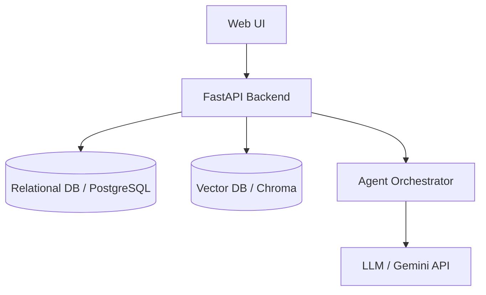

# 04. System Architecture

## Architecture Overview
The system utilizes a modular, microservice-based architecture composed of:
- **Frontend**: Responsive UI (Next.js/React) for bid managers.
- **Backend API**: FastAPI service managing document upload, processing, and agent invocation.
- **Agent Orchestrator**: LangGraph or Autogen framework managing multi-agent workflows.
- **Retrieval Engine (RAG)**: Vector Database (Chroma/Qdrant/pgvector) + Hybrid Search.

## Component Diagram

