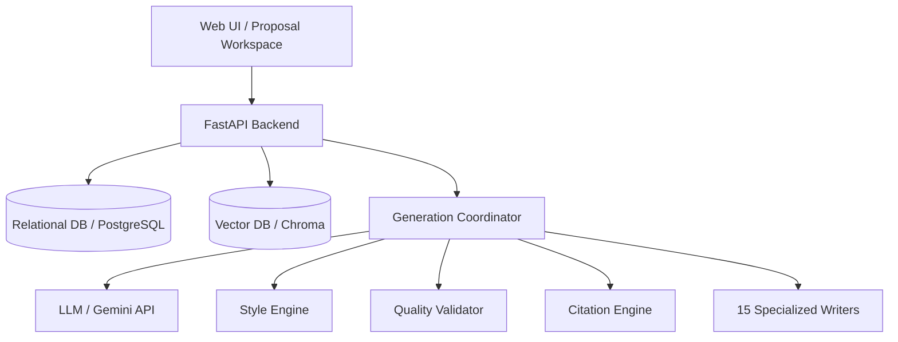

# 04. System Architecture

## Architecture Overview
The system utilizes a modular, microservice-based architecture composed of:
- **Frontend**: Responsive UI (Next.js/React) for bid managers.
- **Backend API**: FastAPI service managing document upload, processing, and agent invocation.
- **Agent Orchestrator**: LangGraph or Autogen framework managing multi-agent workflows.
- **Retrieval Engine (RAG)**: Vector Database (Chroma/Qdrant/pgvector) + Hybrid Search.

## Phase 1 Foundations
- Established Next.js 15 app bootstrap with Tailwind config, themes, and navigation placeholders.
- Configured FastAPI connection and session management pools for PostgreSQL.
- Implemented structured rotating logging, exception handling pipelines, and dependency injection schemas.

## Phase 10 Multi-Agent Proposal Generation
- Orchestrated Proposal Generator Service incorporating a Prompt Registry, Generation Coordinator, Style Engine, Quality Validator, and Citation Engine.
- 15 specialized writers configured with dynamic prompts and versioning controls.
- Automatic quality checks: duplicate content detection, formatting validators, length checkers, and tone scoring.
- Web UI workspace with outline navigation, side-by-side diff comparison, evidence sidebar displaying knowledge source links, and performance/quality charts.

## Component Diagram

## Phase 10.5 Enterprise AI Platform Foundation
- Decoupled `BaseAgent` framework with standardised execution runners.
- Relational Registry Subsystems: Model Registry, Agent Registry, Prompt Registry, Tool Registry, Workflow Registry, and Capability Registry.
- Centralised Governance Layer: Sanitises PII, blocks prompt injections, enforces safety words, and applies guardrails to model outputs.
- Monitoring and Analytics: Tracks token metrics (latency, input/output count, costs) and registers explainability inputs, evidence, and reasoning outputs in relational tables.
- Stateful agent cache context via KV `agent_memory` tables.
- Pub/Sub notification events (e.g. `AgentStarted`, `AgentFinished`) routed through a global event bus.

## Phase 3 Ingestion Pipeline & Storage
- Implemented `LocalStorageService` implementing `StorageInterface` to encapsulate document writes to local directory, enabling future migration to AWS S3/Azure Blob.
- Integrated `PDFProcessor` (via PyMuPDF) and `DOCXProcessor` (via python-docx) resolved dynamically by `DocumentProcessorFactory`.
- Created structured upload APIs processing mime validations, page/word count extractions, and relational DB status logging.

## Phase 8 Proposal Planning Engine
- Automated proposal outline builder dynamically mapping sections, owners, and effort budgets.
- Automated WBS generation, Milestones calendar tracking, required document checklist, and Q&A clarification logging.
- Integrated human-in-the-loop (HITL) gate controls enforcing lock states and director review approvals.

## Phase 9 Enterprise Knowledge Platform
- Semantic chunking engine segmenting text by headings, sections, or paragraphs.
- Swappable Embedding Swapper model interface supporting Sentence Transformers, BGE, Jina, and Nomic.
- Abstract Vector Database mapping PostgreSQL pgvector and an in-memory/FAISS fallback.
- Hybrid Search pipeline (70% Semantic, 30% Keyword) with metadata filters, top-K settings, confidence thresholds, reranking, and citation tracers.

