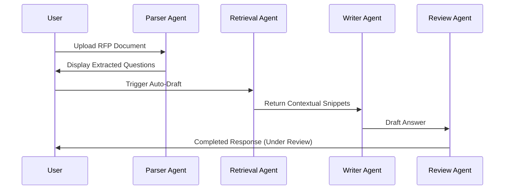

# 08. Workflow Specifications

## End-to-End Proposal Workflow

```mermaid
sequenceDiagram
    participant User
    participant Parser as Parser Agent
    participant Retriever as Retrieval Agent
    participant Writer as Writer Agent
    participant Reviewer as Review Agent

    User->>Parser: Upload RFP Document
    Parser->>User: Display Extracted Questions
    User->>Retriever: Trigger Auto-Draft
    Retriever->>Writer: Return Contextual Snippets
    Writer->>Reviewer: Draft Answer
    Reviewer->>User: Completed Response (Under Review)
```
