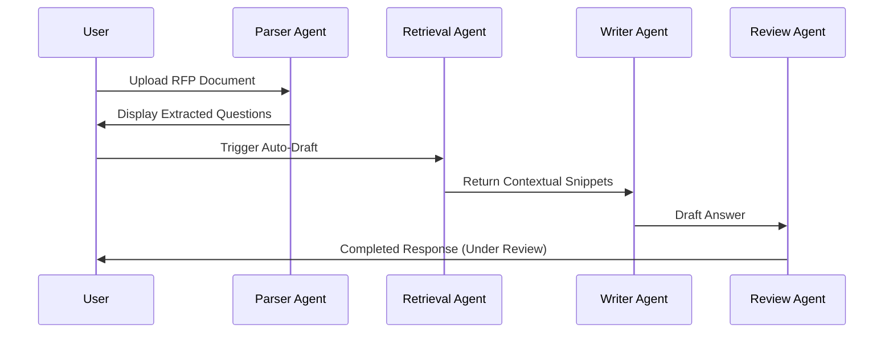

# 08. Workflow Specifications

## End-to-End Proposal Workflow

## GraphState & Gate Transitions (Phase 2)
The proposal lifecycle is governed by the strongly-typed `GraphState` containing:
- `requirements`: Extracted text.
- `reviews`: Department decisions.
- `approvals`: Trackers for **Gate 1 (Requirements)**, **Gate 2 (Qualification)**, **Gate 3 (Planning)**, and **Gate 4 (Proposal validation)**.
- `compliance_items`: Auto-assessment mappings.
- `audit`: Correlation details.

## Document Understanding Workflow (Phase 4)
Before requirement extraction starts, the document enters the **AI Document Understanding** cycle:
1. **Extraction**: Document text is read via Fitz or Docx.
2. **Analysis Trigger**: The user triggers the `/analyze` API.
3. **Hierarchical Segmentation**: Gemini processes structural text chunks into parent-child sections.
4. **Metadata Isolation**: Key information (deadlines, client name, contacts) is structured.
5. **Quality Review**: System checks for corrupted formatting or scan issues.
6. **DB Registry**: Output models are persisted in `document_section` and `rfp_metadata` tables.

## Proposal Planning Workflow (Phase 8)
1. **Planning Trigger**: User posts to `/proposals/{id}/planning` to kick off proposal planning engine.
2. **Package Synthesis**: Service compiles structural sections, compliance matrix rows, WBS tasks, timeline milestones, document trackers, and clarification Q&As.
3. **Collaboration & Adjustments**: Proposal managers manually adjust outlines, change ownerships, set hours, and update tasks.
4. **Lock Gate (Gate 3)**: Proposal manager triggers `/lock-plan` to freeze configurations.
5. **Director Sign-Off**: Director signs off (`/approve-plan` with action "APPROVE" or "REJECT") to conclude the planning stage.

## Enterprise Knowledge & RAG Ingestion Workflow (Phase 9)
1. **Asset Upload**: Capture Manager posts to `/knowledge/upload` to upload reusable documentation.
2. **Semantic Indexation**: System chunks text semantically by headings, generates embeddings via swappable vectorizer, and maps to vector storage (pgvector/FAISS).
3. **Approval Auditing**: Asset status defaults to DRAFT, transition to APPROVED triggers index updates, logged in governance history.
4. **Hybrid Context Retrieval**: Search console processes query -> filters metadata -> executes hybrid vector & keyword matching -> reranks results -> builds citations with document index tracers.

## Enterprise Proposal Content Generation Workflow (Phase 10)
1. **Initiate Generation**: User triggers proposal generation via `/api/v1/proposals/{proposal_id}/generate`.
2. **Retrieve Context**: For each section, the Generation Coordinator queries the RAG pipeline (Phase 9) to fetch relevant knowledge base chunks and metadata.
3. **Orchestrate Multi-Agent Draft**: The Coordinator invokes specialized writers (from a pool of 15 writers) mapped by section title, passing style instructions from the Tone/Style Engine.
4. **Enforce Quality Validation**: The Quality Validator runs automated checks on generated text: formatting structure, word count compliance, duplicate paragraphs detection, and tone matching.
5. **Citations Engine Mapping**: Traceable links and citations are generated, mapping source documents and page numbers to the text. In case of insufficient knowledge, a `[CONTENT_GAP: 
]` tag is appended.
6. **Workspace Interaction**: The user reviews, compares drafts using the diff editor, looks up evidence in the sidebar, and can selectively regenerate sections with custom prompts/contexts.
7. **Gate 4 (Proposal Validation)**: Once all sections are drafted and approved, the proposal plan status updates to locked, ready for final human sign-off.

## Enterprise AI Platform Foundation Workflow (Phase 10.5)
1. **Agent Request**: Orchestration triggers agent run (e.g. `QualificationAgent.run(db, opp_id)`).
2. **Event Bus Initiation**: Event bus publishes `AgentStarted` event payload.
3. **Governance Injection Check**: Governance service checks inputs for prompt injection patterns. If flagged, rejects execution immediately.
4. **Platform Registry Resolution**:
   - Capabilities registry locates matching agent.
   - Prompts registry resolves prompt templates and version numbers.
   - Models registry resolves model endpoints and configurations.
5. **Execution and Output Sanitization**: Model runs logic, returning plain/structured text. Governance Layer parses text to redact PII (emails/phones), checking content safety block words.
6. **Metrics Audit & Explainability Persistence**:
   - Agent execution metric (latency, tokens count, costs) is logged to `agent_metric`.
   - Inputs, RAG evidence, rule states, reasoning, and outputs are logged in `explainability_record`.
7. **Event Bus Conclusion**: Event bus publishes `AgentFinished` notification, concluding the transaction.
