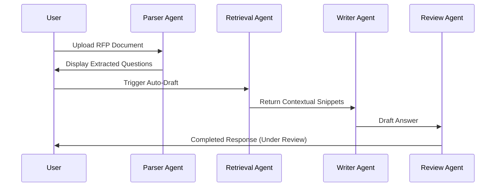

# 08. Workflow Specifications

## End-to-End Proposal Workflow

## GraphState & Gate Transitions (Phase 2)
The proposal lifecycle is governed by the strongly-typed `GraphState` containing:
- `requirements`: Extracted text.
- `reviews`: Department decisions.
- `approvals`: Trackers for **Gate 1 (Requirements)**, **Gate 2 (Qualification)**, **Gate 3 (Planning)**, and **Gate 4 (Proposal validation)**.
- `compliance_items`: Auto-assessment mappings.
- `audit`: Correlation details.

## Document Understanding Workflow (Phase 4)
Before requirement extraction starts, the document enters the **AI Document Understanding** cycle:
1. **Extraction**: Document text is read via Fitz or Docx.
2. **Analysis Trigger**: The user triggers the `/analyze` API.
3. **Hierarchical Segmentation**: Gemini processes structural text chunks into parent-child sections.
4. **Metadata Isolation**: Key information (deadlines, client name, contacts) is structured.
5. **Quality Review**: System checks for corrupted formatting or scan issues.
6. **DB Registry**: Output models are persisted in `document_section` and `rfp_metadata` tables.
