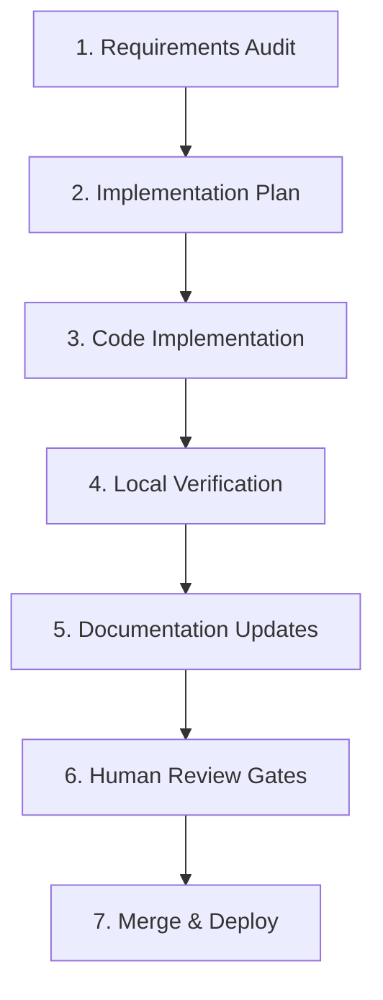

# AI-Driven Engineering Workflow

This document defines the mandatory development lifecycle steps for any future AI agent or developer implementing changes in this repository.

---

## 1. The Standard Workflow Pipeline

### 1.1 Requirements Audit & Research
Before writing any code or modifying configurations:
- Search the `/docs/` folder and inspect active source modules to find existing design patterns.
- Do not reinvent business rules or duplicate helper methods (e.g. database sessions, logging, and AI helper utilities).

### 1.2 Implementation Planning
- If the task involves multiple files or architectural changes, create or update a structured plan (`implementation_plan.md`).
- Detail exactly which files will be modified, added, or removed.
- Highlight potential side-effects or breaking changes.

### 1.3 Implementation & Standards Check
- Write clean, fully typed Python/TypeScript code.
- Enforce strict exception logs and input validations.
- Keep comments and documentation synced.

### 1.4 Local Verification
- Run backend tests: `d:\projects\RFP-venv\Scripts\python.exe -m pytest`
- Check code compilation and formatting.

### 1.5 Documentation & Changelog Update
- Document all changes in the active walk-through and update `CHANGELOG.md` with semantic version increments.

### 1.6 Human Approval Gate
- Stop and present results to the user. Do not proceed to subsequent tasks or features without explicit approval.
