# Evaluator Demonstration Walkthrough Guide

**Version**: 1.0.0  
**Target Audience**: Systems Evaluators, Solution Engineers, Technical Leads  

This document details the scripted, step-by-step demonstration workflow to showcase the end-to-end capabilities of the **SPS Enterprise AI Proposal Capture Manager**.

---

## Scripted Demo Flow (13 Steps)

```mermaid
graph LR
    Upload[1. Upload RFP] --> Parse[2. Extract Requirements] --> Qual[3. Qualification Gate]
    Qual --> Approvals[4. Human Approval] --> WBS[5. Proposal Planning] --> Retrieve[6. Knowledge retrieval]
    Retrieve --> Gen[7. Draft Generation] --> Review[8. Multi-agent review] --> FinalGate[9. Final Gate]
    FinalGate --> Assembly[10. Assembly] --> Export[11. Word Export] --> Stats[12. Observability] --> Audit[13. Security logs]
```

### Step 1: Upload an RFP Document
- **Action**: In the Command Center, drag and drop `dod_cloud_migration_solicitation.pdf` or click "Upload RFP".
- **Concept**: Registers file upload status inside the local storage file system, starting asynchronous ingestion logs.

### Step 2: Requirement Extraction
- **Action**: Select the uploaded RFP from the active document tree. The UI populates compliance matrices.
- **Concept**: Shows how layout boundaries isolate functional and non-functional requirements.

### Step 3: Qualification Decision
- **Action**: Navigate to the "Qualification Gate" tab. View financial, technical, and ops analysis scores.
- **Concept**: Evaluation algorithm ranks the feasibility status of the bid.

### Step 4: Human Approval
- **Action**: Under the Decision Gate, approve the qualification recommendation.
- **Concept**: Human-In-the-loop overrides transition the state from "Ingesting" to "Planning".

### Step 5: Proposal Planning
- **Action**: View WBS task matrices and generated sections templates under "Proposal Writer".
- **Concept**: Organizes outline templates with estimated durations.

### Step 6: Knowledge Retrieval
- **Action**: Search for terms like "zero-trust cryptography" or "identity checks".
- **Concept**: Performs FAISS hybrid searches matching past successful proposal responses.

### Step 7: Proposal Generation
- **Action**: Trigger "Draft Section" or "Generate Draft".
- **Concept**: Asynchronous Celery workers draft the narrative.

### Step 8: Multi-Agent Review
- **Action**: Run specialized QA reviewers (Compliance Officer, Security SME) on the drafted section.
- **Concept**: Validates citation accuracy and formatting rules.

### Step 9: Final Human Approval Gate
- **Action**: Click "Approve Gate" to lock the completed section.
- **Concept**: Prevents further edits on finalized drafts.

### Step 10: Proposal Assembly
- **Action**: Navigate to the Assembly view.
- **Concept**: Merges all locked outline sections in chronological order.

### Step 11: Export Proposal
- **Action**: Click "Export to Word (.docx)" or "Export to Markdown".
- **Concept**: Triggers ExporterService to package the document for delivery.

### Step 12: Analytics & Cost Review
- **Action**: Open the "Observability & Cost" tab.
- **Concept**: Displays cumulative token consumption, latencies, and run-times.

### Step 13: Audit Trail Inspection
- **Action**: Navigate to "Settings -> Security & Audit".
- **Concept**: Reviews chronological log of actions, actors, and transaction correlation IDs.
